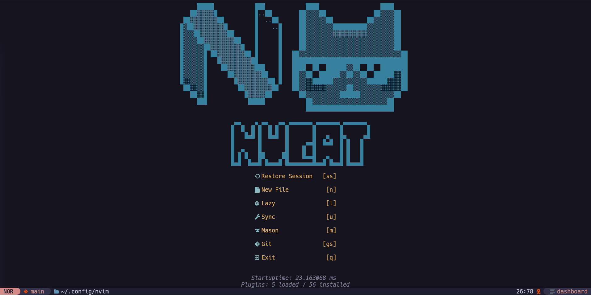

# NvCat
My neovim config

Loads in ~22ms (i3 9100)



---

## Prerequisites:

- [neovim](https://neovim.io)
- [git](https://git-scm.com)
- [Nerd Font](https://www.nerdfonts.com)

### Telescope.nvim

- [fzf](https://github.com/junegunn/fzf)
- [ripgrep](https://github.com/BurntSushi/ripgrep)
- [Make](https://github.com/mirror/make)
<!-- if you have cmake you probably have make installed too -->
<!-- - [CMake](https://cmake.org) / [Make](https://github.com/mirror/make) -->

**you might need different dependencies for your LSP servers**

## Installing

```sh
git clone "https://github.com/MrCatNerd/MyNeovimConfig.git" "$HOME/.config/nvim" # Linux
#git clone "https://github.com/MrCatNerd/MyNeovimConfig.git" "$LOCALAPPDATA/nvim" # Windows

nvim --headless "+Lazy! sync" "+Lazy! build all" +qa
```

To install all of the LSP servers, run:

```sh
nvim --headless "+MasonInstallAll" +qa
```

### clang format
if you want my clang format config, run this in your home or your project directory
- home dir = global (local will override)
- project dir = local ^
```sh
curl --silent "https://raw.githubusercontent.com/MrCatNerd/.dotfiles/refs/heads/main/linux/clangd/.clang-format" -o .clang-format
```

---

## TODO:

- DAP
- add sql support (follow teej's nvim-dbee tutorial)
- add a windows installation guide based on the kickstart.nvim guide cuz its a good windows installation guide
